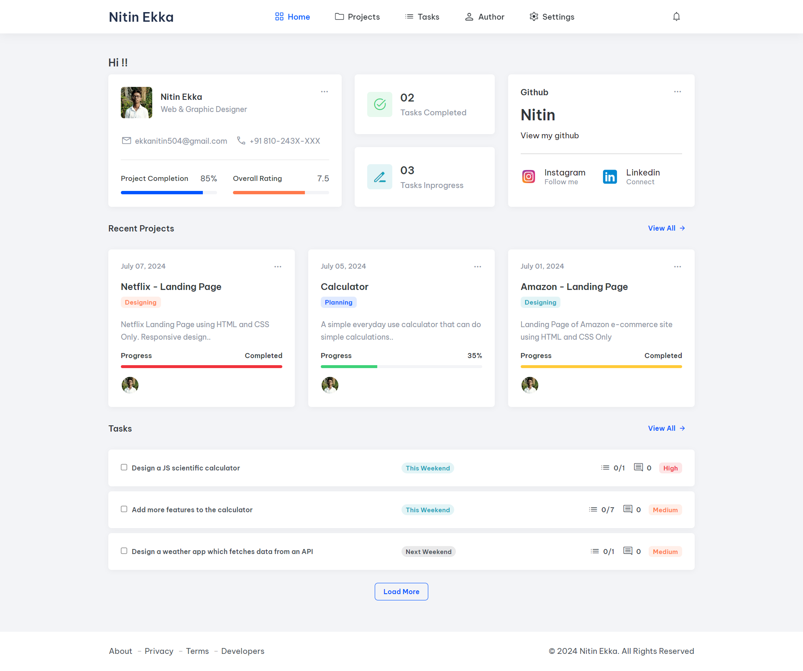
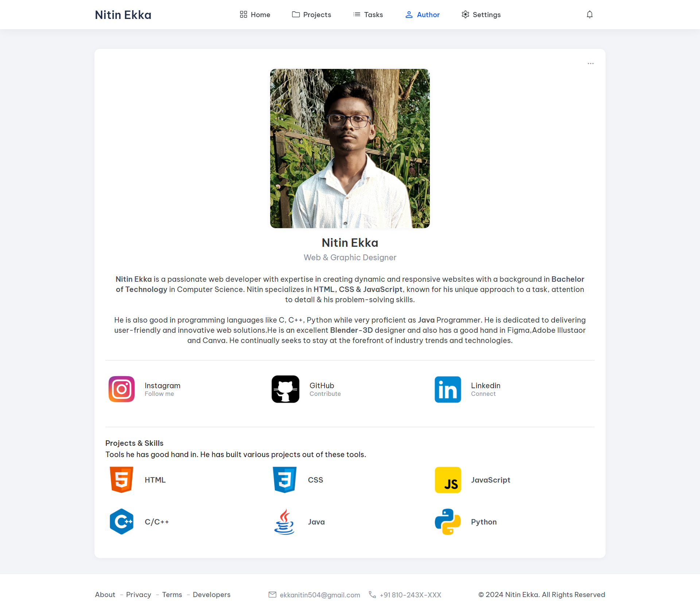
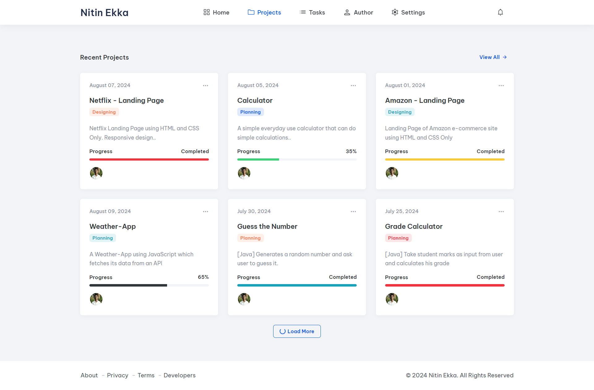

<div align="center">


  <h2 align="center">Portfolio - Nitin Ekka</h2>

  This portfolio is fully responsive for all devices, <br/> Built using HTML, CSS, and JavaScript.


</div>

<br />

### Demo Screenshots

  <br/>

  <br/>

  <br/>

### Prerequisites

Before you begin, ensure you have met the following requirements:

* [Git](https://git-scm.com/downloads "Download Git") must be installed on your operating system.

### Run Locally

To run **PORTFOLIO** locally, run this command on your git bash:

Linux and macOS:

```bash
sudo git clone https://github.com/Nitinekka504/Portfolio.git
```

Windows:

```bash
git clone https://github.com/Nitinekka504/Portfolio.git
```

### Attribution

<a href="https://codewithsadee.github.io/dashboard/"><strong>➥ Live Demo</strong></a>

### License

This project is **free to use** and does not contains any license.
